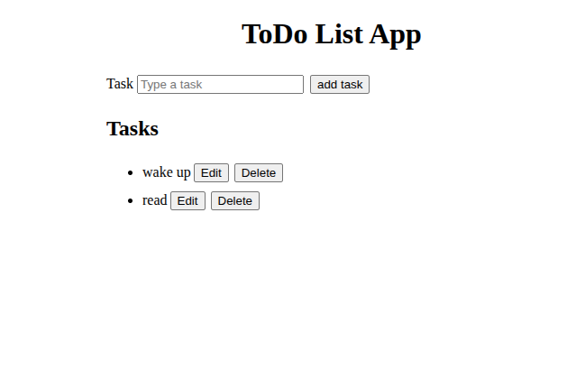
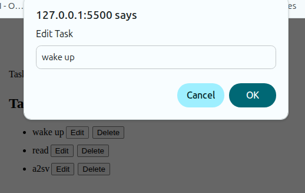

# TODO list App
A todo list application created with Html, css and javascript
 

## Functionality
### Add task
Type the task in the input field and click add task button to add it to the task list
### Edit task
Click the edit button next to the task  and typing the new name in the prompt and click okay

 
### Delete task
 Click the delete button next to the task
 

 ## Installation
1. Clone the repository:
   ```bash
   git clone https://github.com/kibalamaa/todo.git
   cd todo

2. Open 'index.html' in a browser
